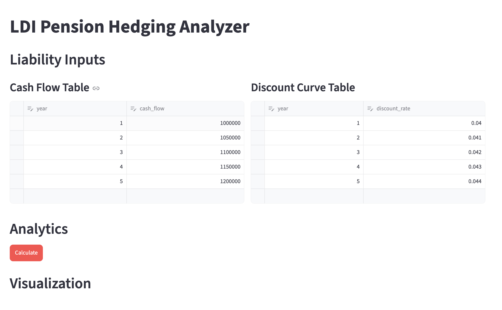
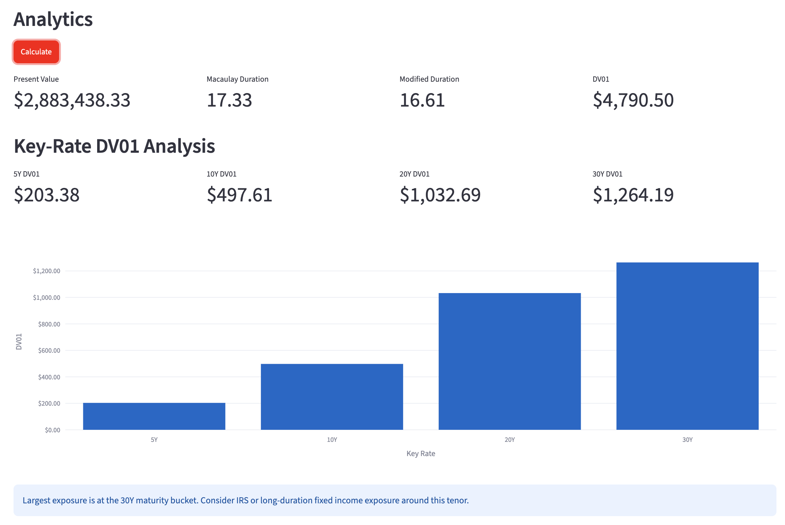
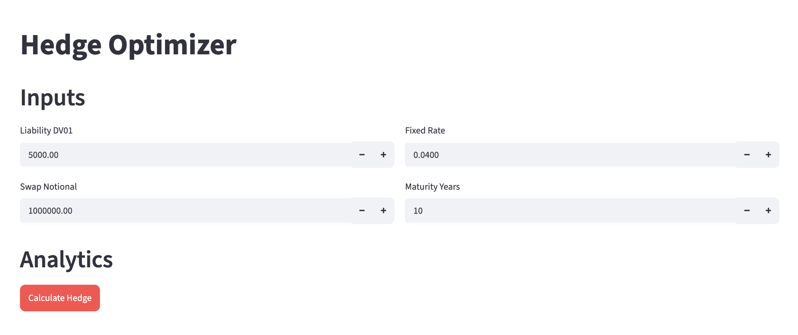
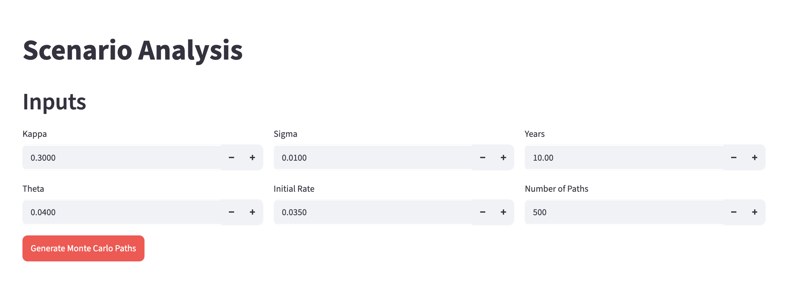
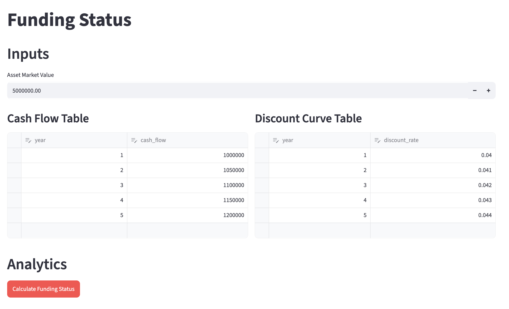
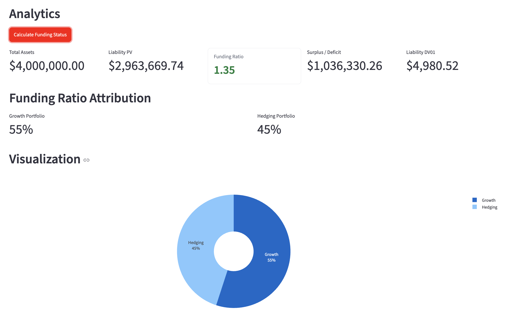
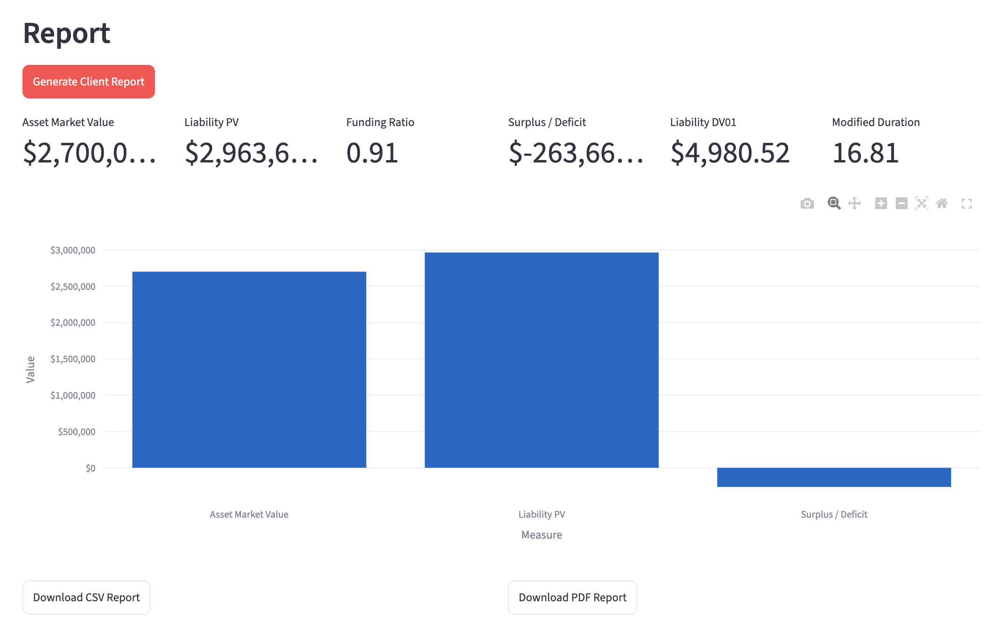

# LDI Pension Hedging Analyzer

[](https://github.com/yijinwang2003-wq/ldi-pension-hedging-analyzer/actions/workflows/ci.yml)

Live Demo:
https://ldi-pension-frontend.onrender.com

API Documentation:
https://ldi-pension-hedging-analyzer.onrender.com/docs

## Overview

LDI Pension Hedging Analyzer is a full-stack Liability-Driven Investment
(LDI) analytics platform designed for defined-benefit pension plans.

The platform helps pension sponsors and investment teams evaluate pension
liabilities, measure interest-rate risk, construct hedging portfolios,
monitor funding status, and generate client-facing reports.

The platform combines clean Python quant models, a FastAPI backend, and a
Streamlit dashboard for interactive analytics.

Built with:

- Python
- FastAPI
- Streamlit
- Plotly
- NumPy
- Pandas
- Pytest

---

## Features

### Liability Analytics

- Present Value
- Macaulay Duration
- Modified Duration
- Parallel DV01
- Key-rate DV01 by maturity bucket
- Maturity-specific curve shock valuation
- Hedge maturity suggestion

### Hedge Optimizer

- Interest Rate Swap valuation
- Fixed leg present value
- Floating leg present value approximation
- Signed Swap DV01 calculation
- Hedge notional estimation
- Before/after hedge DV01 risk visualization
- Hedge ratio, residual DV01, and percent hedged
- What-if funding-ratio sensitivity under +/-100bp shocks
- Narrative recommendation for reaching a target hedge ratio

### Scenario Analysis

- Vasicek short-rate model
- Euler-Maruyama discretization
- Monte Carlo simulation
- Sample rate-path visualization
- Terminal rate distribution
- Summary statistics for terminal rates
- Parallel shift stress scenarios
- Curve twist scenarios: Parallel +100bp, Parallel -100bp, Bear Steepener, Bull Flattener
- Optional custom key-rate shocks
- Nelson-Siegel curve fitting and smooth annual curve generation

### Funding Status

- Growth Portfolio and Hedging Portfolio separation
- Total asset calculation
- Funding ratio calculation
- Surplus / deficit monitoring
- Asset-vs-liability visualization
- Period-over-period funding-ratio attribution

### Client Report

- Downloadable PDF client report
- Downloadable CSV summary
- Executive summary generation
- Growth/Hedging portfolio allocation reporting
- Funding status charts
- Asset return, liability discount-rate, cash-flow, hedge, and residual attribution
- Methodology section

---

## Architecture

```text
Streamlit Frontend
        ↓
FastAPI Backend
        ↓
Quant Models
```

Current implementation:

- All Streamlit pages communicate with the FastAPI backend.
- The FastAPI layer orchestrates the underlying quant model classes.

---

## Project Structure

```text
ldi-pension-analyzer/
├── .github/
│   └── workflows/
│       └── ci.yml
├── backend/
│   ├── Dockerfile
│   ├── main.py
│   ├── api/
│   │   ├── liability.py
│   │   ├── hedging.py
│   │   └── scenarios.py
│   └── models/
│       ├── liability.py
│       ├── hedging.py
│       ├── scenarios.py
│       └── portfolio.py
├── frontend/
│   ├── Dockerfile
│   ├── app.py
│   └── pages/
│       ├── 1_Liability_Analysis.py   # Liability PV, Duration, DV01, Key-Rate DV01
│       ├── 2_Hedge_Optimizer.py      # IRS valuation, hedge notional, DV01 risk
│       ├── 3_Scenario_Analysis.py    # Vasicek Monte Carlo, stress scenarios
│       ├── 4_Funding_Status.py       # Growth/Hedging split, funding ratio, surplus
│       └── 5_Client_Report.py        # PDF/CSV quarterly report generation
├── tests/
│   ├── test_liability.py
│   └── test_hedging.py
├── docker-compose.yml
├── requirements.txt
└── README.md
```

---

## Installation

Create and activate a virtual environment:

```bash
python3 -m venv .venv
source .venv/bin/activate
```

Install dependencies:

```bash
pip install -r requirements.txt
```

---

## Running the Backend

Start the FastAPI backend:

```bash
uvicorn backend.main:app --reload
```

The API will be available at:

```text
http://127.0.0.1:8000
```

Swagger documentation:

```text
http://127.0.0.1:8000/docs
```

Root health endpoint:

```http
GET /
```

Response:

```json
{
  "project": "LDI Pension Hedging Analyzer",
  "status": "running"
}
```

---

## Running the Frontend

In a separate terminal, start Streamlit:

```bash
streamlit run frontend/app.py
```

The dashboard will open at:

```text
http://localhost:8501
```

If port `8501` is already in use:

```bash
streamlit run frontend/app.py --server.port 8502
```

The frontend reads the backend API location from:

```text
API_BASE_URL
```

For local development, it defaults to:

```text
http://127.0.0.1:8000/api
```

---

## Docker Deployment

Run:

```bash
docker compose up --build
```

Frontend:

```text
http://localhost:8501
```

Backend:

```text
http://localhost:8000
```

Swagger:

```text
http://localhost:8000/docs
```

The Docker Compose configuration sets:

```text
API_BASE_URL=http://backend:8000/api
```

To stop the services:

```bash
docker compose down
```

---

## API Endpoints

### Liability Present Value

```http
POST /api/liability/pv
```

Request:

```json
{
  "cash_flows": {
    "1": 1000000,
    "2": 1050000,
    "3": 1100000
  },
  "discount_curve": {
    "1": 0.04,
    "2": 0.041,
    "3": 0.042
  }
}
```

Response:

```json
{
  "present_value": 2912384.12
}
```

### Liability Duration

```http
POST /api/liability/duration
```

Response:

```json
{
  "macaulay_duration": 1.98,
  "modified_duration": 1.90
}
```

### Liability DV01

```http
POST /api/liability/dv01
```

Response:

```json
{
  "dv01": 553.42
}
```

### Liability Key-Rate DV01

```http
POST /api/liability/key-rate-dv01
```

Request:

```json
{
  "cash_flows": {
    "5": 1000000,
    "10": 1250000,
    "20": 1500000,
    "30": 1750000
  },
  "discount_curve": {
    "5": 0.04,
    "10": 0.042,
    "20": 0.045,
    "30": 0.047
  },
  "key_rates": [5, 10, 20, 30]
}
```

Response:

```json
{
  "key_rate_dv01": {
    "5": 421.18,
    "10": 932.45,
    "20": 1884.71,
    "30": 2910.33
  }
}
```

### Curve Twist Scenarios

```http
POST /api/scenarios/curve-twists
```

Request:

```json
{
  "cash_flows": {
    "1": 1000000,
    "5": 1250000,
    "10": 1500000
  },
  "discount_curve": {
    "1": 0.04,
    "5": 0.043,
    "10": 0.047
  },
  "asset_market_value": 3600000,
  "hedge_dv01": 2000,
  "custom_shocks_bps": {
    "1": 0,
    "5": 50,
    "10": 100
  }
}
```

Response excerpt:

```json
{
  "results": [
    {
      "scenario": "Parallel +100bp",
      "liability_pv_change": -253118.27,
      "hedge_impact": -200000,
      "funding_ratio_change_unhedged": 0.0834,
      "funding_ratio_change_hedged": 0.0216
    }
  ]
}
```

### Hedge Effectiveness

```http
POST /api/hedging/effectiveness
```

Response excerpt:

```json
{
  "hedge_ratio": 0.78,
  "percent_hedged": 0.78,
  "residual_dv01": 1100,
  "required_incremental_dv01": 600,
  "required_incremental_notional": 1200000,
  "recommendation": "Current hedge ratio is 78%. To reach 90%, increase IRS notional by approximately $1,200,000.00."
}
```

### Nelson-Siegel Curve Builder

```http
POST /api/scenarios/nelson-siegel
```

Request:

```json
{
  "maturities": [1, 2, 5, 10, 30],
  "rates": [0.038, 0.039, 0.041, 0.044, 0.047],
  "tau": 2.5,
  "output_years": [1, 2, 3, 4, 5, 10, 20, 30]
}
```

Response:

```json
{
  "parameters": {
    "beta0": 0.0491,
    "beta1": -0.0123,
    "beta2": 0.0034,
    "tau": 2.5
  },
  "discount_curve": {
    "1": 0.0381,
    "2": 0.0390,
    "3": 0.0398
  }
}
```

### Funding Attribution

```http
POST /api/reporting/funding-attribution
```

Response excerpt:

```json
{
  "beginning_funding_ratio": 0.9091,
  "ending_funding_ratio": 0.9292,
  "asset_return_contribution": 0.0409,
  "liability_discount_rate_contribution": -0.0207,
  "cash_flow_contribution": 0.0182,
  "hedge_contribution": 0.0136,
  "residual_contribution": -0.0320
}
```

---

## Quant Models

### LiabilityModel

Located in:

```text
backend/models/liability.py
```

Inputs:

- `cash_flows: dict[int, float]`
- `discount_curve: dict[int, float]`

Methods:

- `present_value()`
- `macaulay_duration()`
- `modified_duration()`
- `dv01()`
- `pv_under_parallel_shift(shift_bps)`
- `pv_under_curve_shock(shocks_bps)`

Valuation uses annual compounding:

```text
PV_t = CF_t / (1 + r_t)^t
```

The liability DV01 is reported as a positive currency sensitivity:

```text
DV01 = (PV(-1 bp) - PV(+1 bp)) / 2
```

### InterestRateSwap

Located in:

```text
backend/models/hedging.py
```

Inputs:

- `notional`
- `fixed_rate`
- `maturity_years`
- `discount_curve`

Methods:

- `fixed_leg_pv()`
- `floating_leg_pv()`
- `swap_value()`
- `dv01()`
- `hedge_notional(liability_dv01)`

Fixed leg valuation uses annual fixed coupon payments:

```text
PV_fixed = sum(N * fixed_rate * DF_t)
```

Floating leg valuation is approximated using:

```text
PV_float ~= N * (1 - DF(T))
```

This simplification is intentional for the educational implementation. It keeps
the swap module focused on hedge mechanics rather than full forward-curve
construction, reset schedules, accrual conventions, and curve bootstrapping.

Swap value convention:

```text
swap_value = floating_leg_pv - fixed_leg_pv
```

Swap DV01 is signed:

```text
DV01 = (value(-1 bp) - value(+1 bp)) / 2
```

The sign is important. For example, a liability may have positive DV01, while a
receive-floating/pay-fixed swap can have negative DV01. The hedge notional keeps
this direction:

```text
hedge_notional = liability_dv01 * swap_notional / swap_dv01
```

### VasicekModel

Located in:

```text
backend/models/scenarios.py
```

Inputs:

- `kappa`
- `theta`
- `sigma`
- `r0`

Methods:

- `simulate_path(years, dt)`
- `simulate_paths(years, dt, n_paths)`
- `parallel_shift_scenarios()`
- `summarize_terminal_rates()`

Vasicek short-rate dynamics:

```text
dr = kappa * (theta - r) * dt + sigma * dW
```

Euler-Maruyama discretization:

```text
r[t+1] = r[t] + kappa * (theta - r[t]) * dt + sigma * sqrt(dt) * Z
```

### CurveScenarioAnalyzer

Located in:

```text
backend/models/curve.py
```

The analyzer runs standard curve-shape scenarios plus an optional custom
key-rate shock. Liability PV is revalued exactly against the shocked curve.
Hedge impact is estimated from hedge DV01 or hedge key-rate DV01.

### NelsonSiegelCurve

Located in:

```text
backend/models/curve.py
```

The Nelson-Siegel implementation accepts market maturity/rate points, fits
`beta0`, `beta1`, `beta2`, and either a fixed or grid-searched `tau`, then
generates a smooth annual spot curve:

```text
r(t) = beta0
     + beta1 * (1 - exp(-t / tau)) / (t / tau)
     + beta2 * ((1 - exp(-t / tau)) / (t / tau) - exp(-t / tau))
```

### HedgeEffectivenessAnalyzer

Located in:

```text
backend/models/effectiveness.py
```

Reports hedge ratio, residual DV01, target hedge gap, +/-100bp funding-ratio
sensitivity, and an interview-friendly hedge recommendation.

### FundingAttribution

Located in:

```text
backend/models/attribution.py
```

Builds a funding-ratio bridge from beginning to ending status:

```text
Total change = asset return
             + liability discount-rate effect
             + cash-flow / benefit-payment effect
             + hedge contribution
             + residual
```

---

## Frontend Pages

### Landing Page

```text
frontend/app.py
```

Features:

- Project title
- Sidebar page selection prompt

### Liability Analysis

```text
frontend/pages/1_Liability_Analysis.py
```

Features:

- Editable cash-flow table
- Editable discount-curve table
- Calls FastAPI liability endpoints
- Displays Present Value, Macaulay Duration, Modified Duration, and DV01
- Displays Key-Rate DV01 by maturity bucket
- Suggests a hedge maturity bucket based on largest absolute Key-Rate DV01
- Plots liability cash flows by year

### Hedge Optimizer

```text
frontend/pages/2_Hedge_Optimizer.py
```

Features:

- Inputs for Liability DV01, Swap Notional, Fixed Rate, and Maturity Years
- Computes signed Swap DV01
- Computes required hedge notional
- Plots before/after hedge DV01 risk
- Shows hedge effectiveness summary, residual DV01, +/-100bp sensitivity, and target-hedge recommendation

### Scenario Analysis

```text
frontend/pages/3_Scenario_Analysis.py
```

Features:

- Vasicek parameter inputs
- Monte Carlo short-rate simulation
- Sample path chart
- Terminal rate histogram
- Mean, standard deviation, 5%, median, and 95% terminal-rate metrics
- Curve Twist Scenarios section with hedged vs unhedged funding-ratio comparison
- Nelson-Siegel Curve Builder section with fitted parameters, chart, and generated curve table

### Funding Status

```text
frontend/pages/4_Funding_Status.py
```

Features:

- Growth Portfolio and Hedging Portfolio inputs
- Total asset calculation from equities, credit, long bonds, and IRS exposure
- Editable cash-flow table
- Editable discount-curve table
- Calls FastAPI liability PV and DV01 endpoints
- Computes Liability PV, Funding Ratio, Surplus / Deficit, and Liability DV01
- Shows Growth/Hedging allocation attribution
- Shows period-over-period attribution report
- Color-coded Funding Ratio metric
- Asset-versus-liability, surplus/deficit, and portfolio allocation charts

### Client Report

```text
frontend/pages/5_Client_Report.py
```

Features:

- Client name and report date inputs
- Growth Portfolio and Hedging Portfolio inputs
- Calls FastAPI liability PV, DV01, and duration endpoints
- Generates downloadable CSV summary
- Generates downloadable PDF client report
- Includes portfolio allocation, branded executive summary, metric table, interpretation, charts, and methodology
- Includes period-over-period funding-ratio attribution in CSV and PDF downloads

---

## Screenshots

### Liability Analysis



### Key-Rate DV01 Analysis



### Hedge Optimizer



### Scenario Analysis



### Funding Status



### Funding Ratio Attribution



### Client Report



---

## Testing

Run the test suite:

```bash
python3 -m pytest
```

GitHub Actions runs the same pytest suite on pushes and pull requests to `main`.

Current test coverage includes:

- Liability present value
- Liability duration positivity
- Liability DV01 positivity
- Liability key-rate DV01 behavior
- Liability parallel shift behavior
- Liability input validation
- Swap fixed leg PV
- Swap floating leg PV
- Swap value type
- Signed swap DV01 non-zero check
- Hedge notional direction
- Swap input validation
- Curve twist scenario calculations
- Hedge effectiveness metrics and funding-ratio sensitivity
- Nelson-Siegel fitting and rate formula
- Funding attribution bridge
- Vasicek simulation shape, summary validation, and shift scenarios

---

## Modeling Assumptions

- Annual compounding is used throughout the core liability and swap models.
- Pension cash-flow years are interpreted as annual periods from valuation date.
- Discount curves are represented as year-to-rate dictionaries.
- Liability cash flows must be non-negative.
- Curve twist shocks are entered in basis points and applied directly to matching maturity buckets.
- Hedge DV01 is modeled as positive liability-hedging exposure: it gains when rates fall and loses when rates rise.
- Hedge key-rate DV01 can be supplied when a maturity-bucket hedge profile is available.
- Nelson-Siegel fitting uses NumPy least squares and a simple tau grid search when tau is not fixed.
- Funding attribution is a reporting bridge, not a full actuarial roll-forward.
- Interest-rate swap payments are annual.
- The swap floating leg uses a simplified par floating-leg approximation.
- Vasicek paths are simulated with Euler-Maruyama discretization.
- Scenario Analysis uses a quarterly time step in the Streamlit page.

---

## Roadmap

Potential next improvements:

- Add end-to-end tests for the Streamlit flows.
- Add end-to-end tests for FastAPI routes.
- Support user-entered swap discount curves in the Hedge Optimizer.
- Add CSV upload/export for liability cash flows.
- Add cloud deployment configuration for a hosted demo.

---

## Interview Talking Points

- The project separates liability valuation, hedge construction, curve scenarios,
  and reporting attribution into modular model classes.
- Key-rate DV01 and curve twists show that LDI risk is not only about parallel
  duration; curve shape matters for long pension cash flows.
- Hedge effectiveness is reported as a DV01 coverage ratio plus residual DV01,
  which is the language used in pension risk dashboards.
- Funding-ratio attribution translates market moves into sponsor-level outcomes:
  asset return, liability discount-rate movement, benefit payments, hedge P&L,
  and residual.
- Nelson-Siegel fitting demonstrates how market curve points can become a smooth
  discount curve while preserving manual curve input as a fallback.

## Real-World LDI Connection

In practice, pension sponsors hedge funded-status volatility rather than asset
volatility alone. A long-duration liability rises when rates fall, so a hedging
portfolio of long bonds and swaps is evaluated by how much liability DV01 it
offsets. Curve twist scenarios help identify whether the hedge is concentrated
in the wrong maturity buckets. Attribution then explains whether funding-ratio
movement came from growth assets, liability discount rates, hedge performance,
cash flows, or unexplained residuals.

---

## Disclaimer

This project is for educational and demonstration purposes only. It is not
investment advice, actuarial advice, or a production risk system.
